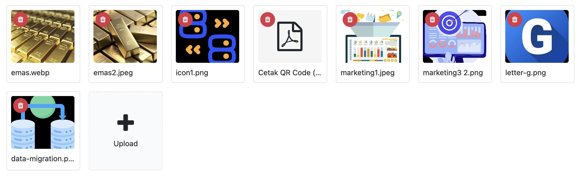

# Odoo Ultimate Attachment

An Odoo module that provides a custom attachment widget for uploading, previewing, and managing attachments directly from form views.

The module provides a thumbnail-based interface for `many2many` attachment fields, with support for image and PDF previews.

## Screenshot



## Features

* Upload multiple attachments at once.
* Display attachments as thumbnails in a grid layout.
* Preview images directly from the form.
* Preview PDF files.
* Open unsupported file types using the Odoo attachment URL.
* Upload attachments through a dedicated upload box.
* Delete attachments directly from the thumbnail.
* Confirmation before deleting an attachment.
* Automatically resize images before uploading to reduce file size.
* Automatically associate uploaded attachments with the current record.
* Prevent uploading attachments when the record has not been saved yet.
* Support attachment management on different Odoo models.

## Requirements

* Odoo 19
* Python 3
* Odoo `web` module

## Installation

Copy the `ultimate_attachment` module into your Odoo addons directory.

Example:

```text
/opt/odoo/addons/ultimate_attachment
```

Then:

1. Restart the Odoo server.
2. Enable Developer Mode.
3. Go to **Apps**.
4. Click **Update Apps List**.
5. Search for **Ultimate Attachment**.
6. Install the module.

## Module Structure

```text
ultimate_attachment/
├── __init__.py
├── __manifest__.py
├── static/
│   └── src/
│       ├── js/
│       │   └── attachment_preview.js
│       ├── xml/
│       │   └── attachment_preview.xml
│       └── scss/
│           └── attachment_preview.scss
└── README.md
```

## Widget

The module provides the following field widget:

```text
ultimate_attachment_preview
```

The widget is designed for `many2many` fields using the `ir.attachment` model.

### Python

Example:

```python
attachment_ids = fields.Many2many(
    "ir.attachment",
    string="Attachments",
)
```

### XML

Use the widget in a form view:

```xml
<field
    name="attachment_ids"
    widget="ua_preview"
/>
```

## Example

Example model:

```python
from odoo import fields, models


class MyModel(models.Model):
    _name = "my.model"
    _description = "My Model"

    name = fields.Char(string="Name")

    attachment_ids = fields.Many2many(
        "ir.attachment",
        string="Attachments",
    )
```

Form view:

```xml
<field
    name="attachment_ids"
    widget="ua_preview"
/>
```

The widget will display attachments in a grid similar to:

## Uploading Attachments

Click the **Upload** box to select one or multiple files.

The module performs the following process:

1. Checks whether the current record has been saved.
2. Reads the selected file.
3. Resizes the image if the file is an image.
4. Converts the file to Base64.
5. Creates an `ir.attachment` record.
6. Associates the attachment with the current record.
7. Reloads the attachment list.

### Unsaved Records

Attachments cannot be uploaded while creating a new record that has not yet been saved.

If the user attempts to upload an attachment before saving the record, the following message is displayed:

```text
Please save the record first before uploading an attachment.
```

This prevents errors caused by an invalid `res_id`.

## Attachment Preview

### Images

Image attachments can be clicked to open a larger preview.

### PDF

PDF attachments can be previewed directly in the browser.

### Other File Types

File types that are not supported for inline preview can be opened using the Odoo attachment URL.

## Delete Attachments

Each attachment has a delete button positioned at the top-left corner of the thumbnail.

When the delete button is clicked:

1. The user is asked to confirm the deletion.
2. The attachment is removed from the `many2many` relation.
3. The corresponding `ir.attachment` record is deleted.
4. The attachment list is refreshed.

## Image Resizing

Images are resized before being uploaded to help reduce file size and improve upload performance.

The original filename and MIME type are preserved when creating the attachment.

## Styling

Widget-specific styling is located in:

```text
static/src/scss/attachment_preview.scss
```

Example:

```scss
.attachment-upload-box {
    cursor: pointer;
    transition: all 0.2s ease;
}

.attachment-upload-box:hover {
    background: #e9ecef !important;
    border-color: #6c757d !important;
}
```

The upload box provides a visual hover effect to indicate that it is clickable.

## Assets

The JavaScript, XML template, and SCSS files must be included in the module assets.

Example `__manifest__.py`:

```python
'assets': {
    'web.assets_backend': [
        'ultimate_attachment/static/src/js/attachment_preview.js',
        'ultimate_attachment/static/src/xml/attachment_preview.xml',
        'ultimate_attachment/static/src/scss/attachment_preview.scss',
    ],
},
```

After modifying frontend assets, upgrade the module and perform a hard refresh of the browser.

## Technical Details

The widget uses Odoo's Owl framework and ORM service.

Uploaded attachments are stored using the standard Odoo:

```text
ir.attachment
```

model.

Each attachment is associated with the current record using:

```text
res_model
res_id
```

The `many2many` field maintains the relationship between the business record and its attachments.

## Record Lifecycle

The widget requires the current record to have a valid database ID before uploading an attachment.

For a new record:

```text
New Record
    │
    ▼
Record not saved
    │
    ├── Upload → Blocked
    │
    └── Save
          │
          ▼
     Record has ID
          │
          ▼
     Upload enabled
```

This ensures that every uploaded attachment has a valid `res_id`.

## Compatibility

| Component          | Version         |
| ------------------ | --------------- |
| Odoo               | 19              |
| Frontend Framework | Owl             |
| Attachment Model   | `ir.attachment` |
| Field Type         | Many2many       |
| Styling            | SCSS            |

## License

This module is licensed under the [GNU Lesser General Public License v3.0](LICENSE).

Copyright © 2026 [Surya Semesta Berkat Dunia](https://www.suryasemesta.com).